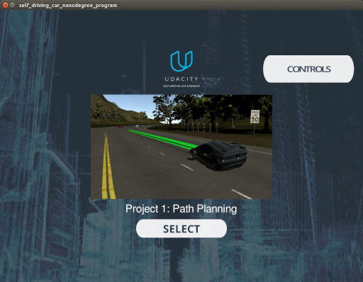
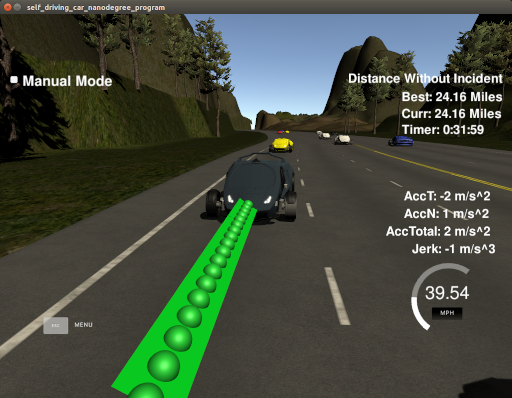

# CarND-Path-Planning-Project-P1
Udacity Self-Driving Car Nanodegree - Path Planning Project

# Overview

In this project, the goal is to design a path planner that is able to create smooth, safe paths for the car to follow along a 3 lane highway with traffic on a simulator provided by Udacity([the simulator could be downloaded here](https://github.com/udacity/self-driving-car-sim/releases/tag/T3_v1.2)). A successful path planner will be able to keep inside its lane, avoid hitting other cars, and pass slower moving traffic all by using localization, sensor fusion, and map data.

The simulator sends car telemetry information (car's position and velocity) and sensor fusion information about the rest of the cars in the highway (Ex. car id, velocity, position). It expects a set of points spaced in time at 0.02 seconds representing the car's trajectory. The communication between the simulator and the path planner is done using [WebSocket](https://en.wikipedia.org/wiki/WebSocket). The path planner uses the [uWebSockets](https://github.com/uNetworking/uWebSockets) WebSocket implementation to handle this communication. Udacity provides a seed project to start from on this project ([here](https://github.com/udacity/CarND-Path-Planning-Project)).
## Goals
In this project your goal is to safely navigate around a virtual highway with other traffic that is driving +-10 MPH of the 50 MPH speed limit. You will be provided the car's localization and sensor fusion data, there is also a sparse map list of waypoints around the highway. The car should try to go as close as possible to the 50 MPH speed limit, which means passing slower traffic when possible, note that other cars will try to change lanes too. The car should avoid hitting other cars at all cost as well as driving inside of the marked road lanes at all times, unless going from one lane to another. The car should be able to make one complete loop around the 6946m highway. Since the car is trying to go 50 MPH, it should take a little over 5 minutes to complete 1 loop. Also the car should not experience total acceleration over 10 m/s^2 and jerk that is greater than 10 m/s^3.

The map of the highway is in data/highway_map.txt
Each waypoint in the list contains [x,y,s,dx,dy] values. x and y are the waypoint's map coordinate position, the s value is the distance along the road to get to that waypoint in meters, the dx and dy values define the unit normal vector pointing outward of the highway loop.

The highway's waypoints loop around so the frenet s value, distance along the road, goes from 0 to 6945.554.

#### Main car's localization Data (No Noise)

["x"] The car's x position in map coordinates

["y"] The car's y position in map coordinates

["s"] The car's s position in frenet coordinates

["d"] The car's d position in frenet coordinates

["yaw"] The car's yaw angle in the map

["speed"] The car's speed in MPH

#### Previous path data given to the Planner

//Note: Return the previous list but with processed points removed, can be a nice tool to show how far along
the path has processed since last time. 

["previous_path_x"] The previous list of x points previously given to the simulator

["previous_path_y"] The previous list of y points previously given to the simulator

#### Previous path's end s and d values 

["end_path_s"] The previous list's last point's frenet s value

["end_path_d"] The previous list's last point's frenet d value

#### Sensor Fusion Data, a list of all other car's attributes on the same side of the road. (No Noise)

["sensor_fusion"] A 2d vector of cars and then that car's [car's unique ID, car's x position in map coordinates, car's y position in map coordinates, car's x velocity in m/s, car's y velocity in m/s, car's s position in frenet coordinates, car's d position in frenet coordinates. 

## Details

1. The car uses a perfect controller and will visit every (x,y) point it recieves in the list every .02 seconds. The units for the (x,y) points are in meters and the spacing of the points determines the speed of the car. The vector going from a point to the next point in the list dictates the angle of the car. Acceleration both in the tangential and normal directions is measured along with the jerk, the rate of change of total Acceleration. The (x,y) point paths that the planner recieves should not have a total acceleration that goes over 10 m/s^2, also the jerk should not go over 50 m/s^3.

2. There will be some latency between the simulator running and the path planner returning a path, with optimized code usually its not very long maybe just 1-3 time steps. During this delay the simulator will continue using points that it was last given, because of this its a good idea to store the last points you have used so you can have a smooth transition. previous_path_x, and previous_path_y can be helpful for this transition since they show the last points given to the simulator controller with the processed points already removed. You would either return a path that extends this previous path or make sure to create a new path that has a smooth transition with this last path.


# Prerequisites

The project has the following dependencies (from Udacity's seed project):

- cmake >= 3.5
- make >= 4.1
- gcc/g++ >= 5.4
- libuv 1.12.0
- [uWebSockets](https://github.com/uWebSockets/uWebSockets)
- Udacity's simulator.

For instructions on how to install these components on different operating systems, please, visit [Udacity's seed project](https://github.com/udacity/CarND-Path-Planning-Project).

# Compiling and executing the project

## Basic Build Instructions

1. Clone this repo.
2. Make a build directory: `mkdir build && cd build`
3. Compile: `cmake .. && make`
```
$ cmake .. && make
-- The C compiler identification is GNU 5.4.0
-- The CXX compiler identification is GNU 5.4.0
-- Check for working C compiler: /usr/bin/cc
-- Check for working C compiler: /usr/bin/cc -- works
-- Detecting C compiler ABI info
-- Detecting C compiler ABI info - done
-- Detecting C compile features
-- Detecting C compile features - done
-- Check for working CXX compiler: /usr/bin/c++
-- Check for working CXX compiler: /usr/bin/c++ -- works
-- Detecting CXX compiler ABI info
-- Detecting CXX compiler ABI info - done
-- Detecting CXX compile features
-- Detecting CXX compile features - done
-- Configuring done
-- Generating done
-- Build files have been written to: /home/bibagimon/CarND-Path-Planning-Project/build
Scanning dependencies of target path_planning
[ 16%] Building CXX object CMakeFiles/path_planning.dir/src/helpers.cpp.o
[ 33%] Building CXX object CMakeFiles/path_planning.dir/src/main.cpp.o
[ 50%] Building CXX object CMakeFiles/path_planning.dir/src/vehicle.cpp.o
[ 66%] Building CXX object CMakeFiles/path_planning.dir/src/planner.cpp.o
[ 83%] Building CXX object CMakeFiles/path_planning.dir/src/road.cpp.o
[100%] Linking CXX executable path_planning
[100%] Built target path_planning
```
4. Run it: `./path_planning`.
```
$ ./path_planning 
Listening to port 4567
```

Now the path planner is running and listening on port 4567 for messages from the simulator. Next step is to open Udacity's simulator:



Click the "Select" button. Have fun!

# [Rubic](https://review.udacity.com/#!/rubrics/1020/view) points

## Compilation

### The code compiles correctly.

`helpers.h` was refactored and a companion `helpers.cpp` was created. Few new files were added.
* [src/spline.h](./scr/spline.h). It is the [Cubic Spline interpolation implementation](http://kluge.in-chemnitz.de/opensource/spline/): a single .h file you can use splines instead of polynomials. It was a great suggestion from the classroom QA video. It works great.
* [src/road.h](./src/road.h), [src/road.cpp](./src/road.cpp)
* [src/vehicle.h](./src/vehicle.h), [src/vehicle.cpp](./src/vehicle.cpp)
* [src/planner.h](./src/planner.h), [src/planner.cpp](./src/planner.cpp)

[CMakeLists.txt](./CMakeLists.txt) was modified so that the code compiles correctly.

## Valid trajectories

### The car is able to drive at least 4.32 miles without incident.

Yes, it can drive at least 4.32 miles without incident.


### The car drives according to the speed limit.
No speed limit red message was seen.

### Max Acceleration and Jerk are not Exceeded.
Max jerk red message was not seen.

### Car does not have collisions.
No collisions.

### The car stays in its lane, except for the time between changing lanes.
The car stays in its lane most of the time but when it changes lane because of traffic or to return to the center lane.

### The car is able to change lanes
The car change lanes when the there is a slow car in front of it, and it is safe to change lanes (no other cars around) or when it is safe to return the center lane.

## Reflection

Based on the provided code from the seed project, the path planning algorithms start at [src/main.cpp](./src/main.cpp#L103) line 103 to the line 155. Several new classes like `Vehicle`, `Road` and `Planner` was implemented to make abtract real world counterparts.

### Prediction, Planning and Trajectory Generation
1. Update `ego_car` state with sensor fusion data: `src/main.cpp L103 - L115`
2. Instantiate other car objects from sensor fusion data and group them by lane: `src/main.cpp L117 - L141`
4. Instantiate road object with car info: `src/main.cpp L143`
5. Call planner to predict and plan whether to keep lane, or change lane to left or right

### Prediction and Behavior [line 91 to line 198](./src/planner.cpp#L91)

Using predictions, it wants to answer the following questions:
- Is there a car in front of us blocking the traffic.
- Is there a car to the right of us making a lane change not safe.
- Is there a car to the left of us making a lane change not safe.

These questions are answered by calculating the lane each other car is and the position it will be at the end of the last plan trajectory. A car is considered "dangerous" when its distance to our car is less than 30 meters in front or behind us.

Once influence of other cars' position is predicted, we want to plan future behavior as follows:
  - If we have a car in front of us, do we change lanes?
  - If both left lane and right lane is safe for change, which one is best
  - How frequently do we change the lane?
  - Do we speed up or slow down?

#### Lane Change
To safely change the lane, gap between the front car and back car in the target lane is predicted. If both the gaps are greater than 30 meters, a lane change is done. If both left left lane and right lane is safe for change, the lane that has more gap between the front car and ego car is choosen (./src/planner.cpp L156-L157).

#### Speed
Note: Varible `ref_val` and `speed_diff` used to control the speed of the ego car. These are used to generate the trajectory (./src/planner.cpp L216-L243). This approach makes the car more responsive acting faster to changing situations like a car in front of it trying to apply breaks to cause a collision.

If lane change is not possible and front car speed is lower than ego car, the velocity of ego car is decreased (./src/planner.cpp L169-L171). If the gap is less than 15 meters, it is further decreased through `speed_diff` variable (./src/planner.cpp L174-L176).

### Trajectory Generation (./src/planner.cpp L156-L157)
This code does the calculation of the trajectory based on the speed and lane output from the behavior, car coordinates and past path points.

First, the last two points of the previous trajectory(L40-L46) or the car position if there are no previous trajectory(L31-L40) are used in conjunction three points at a far distance (lines 49 to 61) to initialize the spline calculation (line 85 and 86). To make the work less complicated to the spline calculation based on those points, the coordinates are transformed (shift and rotation) to local car coordinates (lines 68 to 83).

In order to ensure more continuity on the trajectory (in addition to adding the last two point of the pass trajectory to the spline adjustment), the pass trajectory points are copied to the new trajectory (lines 204 to 207). The rest of the points are calculated by evaluating the spline and transforming the output coordinates to not local coordinates (lines 216 to 243). Worth noticing the change in the velocity of the car from line 217 to 223. The speed change is decided on the behavior part of the code, but it is used in that part to increase/decrease speed on every trajectory points instead of doing it for the complete trajectory.